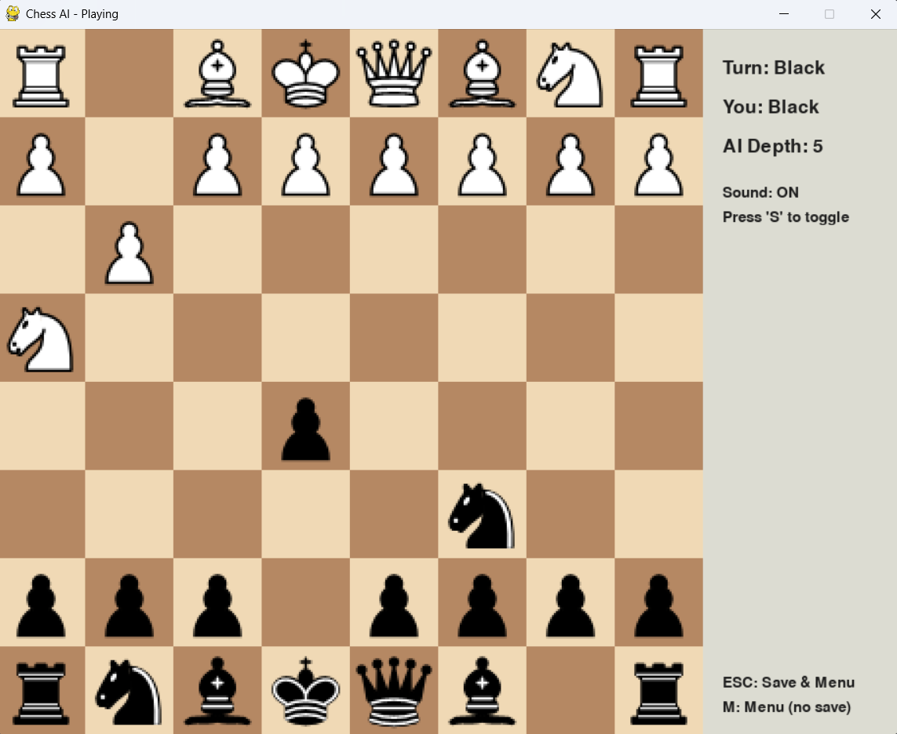

# Chess AI

A classic chess game built with Python and Pygame, where you can play against a configurable AI opponent. The AI's strength can be adjusted, and it utilizes various search algorithms from simple greedy choices to more complex Minimax with Alpha-Beta pruning.



## Features

-   **Playable Chess Game:** A fully functional chess game against an AI.
-   **Configurable AI Difficulty:** Adjust the AI's search depth from 1 to 6 via a slider in the main menu.
-   **Intelligent AI Algorithms:** The AI uses different strategies based on the selected depth:
    -   **Depth ≤ 0:** Random moves
    -   **Depth 1:** Greedy algorithm (chooses the move with the best immediate score)
    -   **Depth 2:** Minimax algorithm
    -   **Depth ≥ 3:** Minimax with Alpha-Beta Pruning for more efficient searching.
-   **Interactive UI:** A clean and responsive user interface built with Pygame.
-   **Side Selection:** Choose to play as either White or Black.
-   **Visual Feedback:**
    -   Smooth animations for piece movements.
    -   Highlights for the selected piece and legal moves.
    -   A red highlight indicates when a king is in check.
-   **Game State Management:**
    -   Save your current game and load it later.
    -   Game-over screen for checkmate and stalemate.
-   **Audio Cues:** Sound effects for moves, captures, checks, and the end of the game. Sound can be toggled on/off.
-   **Informative Game Panel:** A side panel displays the current turn, your color, the AI's depth, and control hints.

## Installation

To run this project locally, follow these steps.

**Prerequisites:**
- Python 3.x
- Git

**Setup:**

1.  **Clone the repository:**
    ```sh
    git clone https://github.com/phunghoang1909/chess-ai.git
    cd chess-ai
    ```

2.  **Install dependencies:**
    It is recommended to use a virtual environment.
    ```sh
    # Create and activate a virtual environment (optional but recommended)
    python -m venv venv
    source venv/bin/activate  # On Windows, use `venv\Scripts\activate`

    # Install the required packages
    pip install -r requirements.txt
    ```

3.  **Run the game:**
    ```sh
    python main.py
    ```

## How to Play

1.  **Main Menu:**
    -   When you launch the game, you will be greeted by the main menu.
    -   Use the **slider** to adjust the AI's search depth. A higher depth means a stronger, but slower AI.
    -   Click the **"White"** or **"Black"** buttons to choose your side.
    -   Click **"NEW GAME"** to start a game with your selected settings.
    -   Click **"LOAD GAME"** to resume a previously saved game (this button is disabled if no save file is found).
    -   Click **"QUIT"** to exit the application.

2.  **In-Game:**
    -   Click on one of your pieces to select it. Legal moves will be indicated by green circles.
    -   Click on a valid destination square to make your move.
    -   The AI will think for a moment (with a delay to feel more natural) before making its move.

3.  **Controls:**
    -   `S`: Toggle sound effects on/off.
    -   `M`: Return to the main menu without saving the current game.
    -   `Esc`: Save the current game and return to the main menu.

## Project Structure

The repository is organized as follows:

```
├── main.py             # Main application entry point
├── requirements.txt    # Project dependencies
├── settings.py         # Configuration constants (colors, sizes, speeds)
├── assets/
│   ├── images/         # PNG images for chess pieces
│   └── sounds/         # WAV sound files for game events
└── src/
    ├── ai.py           # AI logic (Random, Greedy, Minimax, Alpha-Beta)
    ├── board.py        # Functions for drawing the board, pieces, and animations
    ├── game.py         # Main game loop, event handling, and UI panel
    ├── menu.py         # Main menu screen logic and UI
    ├── save_load.py    # Functions to save and load game state to/from JSON
    ├── sound.py        # Sound manager class
    └── utils.py        # Utility functions (e.g., coordinate conversion)